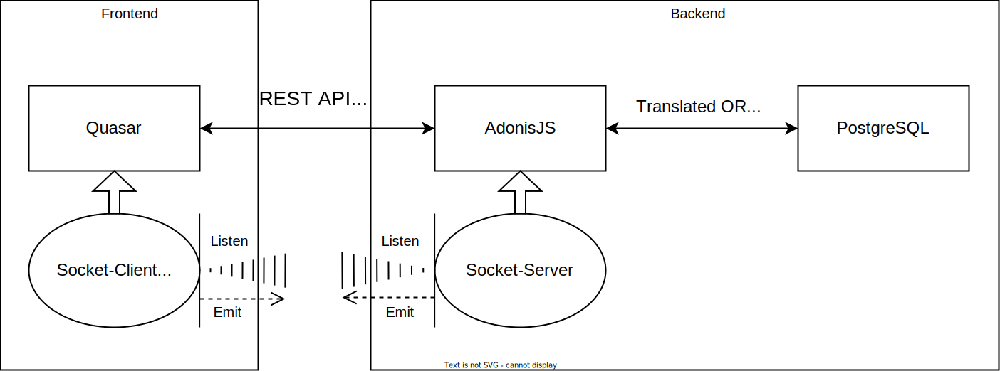
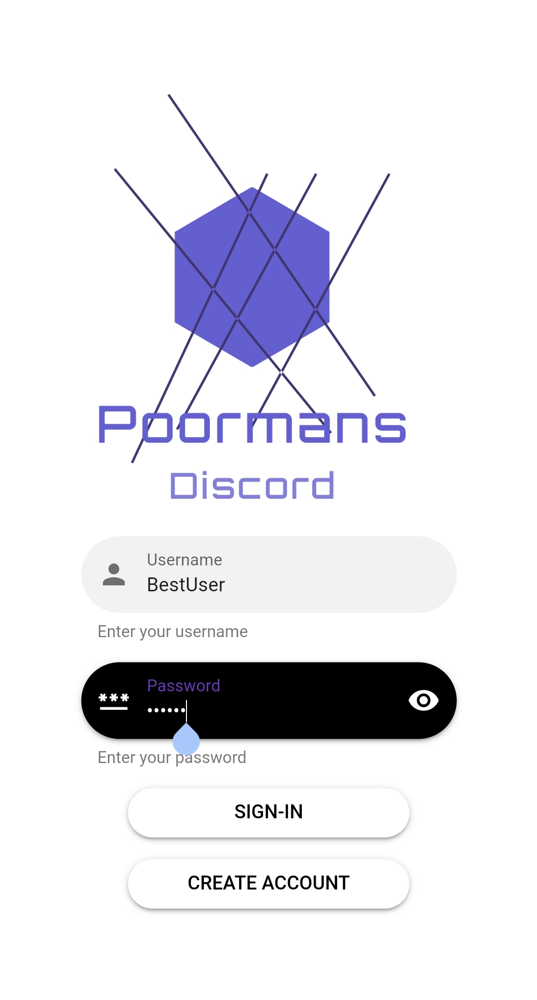

# Poormans Discord (vpwa-frontend)


A Discord clone written using Quasar for VPWA (Development of Progressive Web Applications) course. The app implements various use cases according to the project assignment without use cases 8 and 11 (no WTECH).

Please read [submission notes](#Notes) before testing.

The app is [deployed on a Linode server](http://139.162.130.177:4000/) for you to try.

## Assignment

Aplikácia na textovú komunikáciu v štýle IRC (zjednodušený Slack)\
**Aplikácia musí realizovať tieto prípady použitia:**
Akékoľvek iné vylepšenia sú vítané a potešia ma :-)

1. registrácia, prihlásenie a odhlásenie používateľa
   * používateľ má meno a priezvisko, nickName a email
2. používateľ vidí zoznam kanálov, v ktorých je členom
   * pri opustení kanála, alebo trvalom vyhodení z kanála je daný kanál odobratý zo zoznamu
   * pri pozvánke do kanála je daný kanál zvýraznený a topovaný
   * v zozname môže cez používateľské rozhranie kanál vytvoriť, opustiť, a ak je správcom aj zrušiť
   * dva typy kanálov - súkromný (private channel) a verejný kanál (public channel)
   * správcom kanála je používateľ, ktorý kanál vytvoril
   * ak nie je kanál aktívny (nie je pridaná nová správa) viac ako 30 dní, kanál prestáva existovať (následne je možné použiť channelName kanála pre "nový" kanál)
3. používateľ odosiela správy a príkazy cez "príkazový riadok", ktorý je "fixným" prvkom aplikácie. používateľ môže odoslať správu v kanáli, ktorého je členom
4. vytvorenie komunikačného kanála (channel) cez príkazový riadok
    * kanál môže vytvoriť ľubovolný používateľ cez príkaz /join channelName [private]
    * do súkromného kanála môže pridávať/odoberať používateľov iba správca kanála cez príkazy /invite nickName a /revoke nickName
    * do verejného kanála sa môže pridať ľubovolný používateľ cez príkaz /join channelName (ak kanál neexistuje, automaticky sa vytvorí)
    * do verejného kanála môže člen kanála pozvať iného používateľa príkazom /invite nickName
    * vo verejnom kanáli môže člen "vyhodiť" iného člena príkazom /kick nickName. ak tak spravia aspoň 3 členovia, používateľ má "trvalý" ban pre daný kanál. správca môže používateľa vyhodiť "natrvalo" kedykoľvek príkazom /kick nickName, alebo naopak "obnovit" používateľovi prístup do kanála cez príkaz /invite
    * nickName ako aj channelName sú unikátne
    * správca môže kanál zatvoriť/zrušiť príkazom /quit
5. používateľ môže zrušiť svoje členstvo v kanáli príkazom /cancel, ak tak spraví správca kanála, kanál zaniká
6. správu v kanáli je možné adresovať konkrétnemu používateľovi cez príkaz @nickname
    * správa je zvýraznená danému používateľovi v zozname správ
7. používateľ si môže pozrieť kompletnú históriu správ
    * efektívny inifinite scroll
8. používateľ je informovaný o každej novej správe prostredníctvom notifikácie
    * notifikácia sa vystavuje iba ak aplikácia nie je v stave "visible" (pozrite quasar docu App Visibility)
    * notifikácia obsahuje časť zo správy a odosielateľa
    * používateľ si môže nastaviť, aby mu chodili notifikácie iba pre správy, ktoré sú mu adresované
9. používateľ si môže nastaviť stav (online, DND, offline)
    * stav sa zobrazuje používateľom
    * ak je nastavený DND stav, neprichádzajú notifikácie
    * ak je nastavený offline stav, neprichádzajú používateľovi správy, po prepnutí do online sú kanály automaticky aktualizované
10. používateľ si môže pozrieť zoznam členov kanála (ak je tiež členom kanála) príkazom /list
11. ~~ak má používateľ aktívny niektorý z kanálov (nachádza sa v okne správ pre daný kanál) vidí v stavovej lište informáciu o tom, kto aktuálne píše správu (napr. Ed is typing)~~
    * ~~po kliknutí na nickName si môže pozrieť rozpísaný text v reálnom čase, predtým, ako ju odosielateľ odošle (každá zmena je viditeľná) :-)~~

## Notes

### First submission

As of 27.3.2022, the project is partly done, with implemented finished layout, all use cases and a vuex store to hold temporary, hardcoded dummy data. The data will be swapped for data from a PostgresSQL database accessed by using API calls at a later stage.

To test the app, you can register a new user (does not actually store data except the username, it is mainly used only for UI presentation), or log in as a user (there are a few pre-made users with access to various channels) - viktor, dominik, jozko, janko. So far, there is no user authentication, as that requires a backend. After logging in, one can change user data by clicking the profile picture, set status, and/or change login credentials.

There is a possibility to create/leave/delete a channel by UI components, or using commands. There are messages already stored in channels #chatting and #memes, which are public - indicated by # symbol. Other dummy channels are private indicated by a lock icon.

Commands can be used in the message text field while the available commads are shown in a dialog above it.

After refreshing the page, the login information of a user persists, channel data are restored to dummy data.

### Final submission

The app is deployed on this [link](http://139.162.130.177:4000/#/).

As of 8.5.2022, the project is done. The layout of the application was slightly tweaked to better handle data from api server. All dumy data was replaced with api calls and socket communication. All data are persisted in a PostrgeSQL database.

The app is usable according to all the specification in the assignment excpet point 11.

Since the first submission we have decided to implement use case number 6 and 8 as well. Messages that are addressed to the user are now highlited with purple color, as well as the tag itself is highlited. User receives a notification when a mesage is posted into one of users channels, that the user is not currently in. A notification sound also plays when the app is not in focus/visible, according to quasar app visibility.

## Data model

The proposed database schema for the future backend. It is subject to change before implementation.

<details>
<summary><b>Show database schema</b></summary>


</details>

## Design decisions

During the development of this app we came with several design decisions.

The user login is remembered in a browser, so that the user doesnt have to login everytime the app is accessed. This is done using a `vuex-persistedstate` library, that is used as a vuex extension on userData store.

User status is persisted in the database, as well as local storage, so that other user of the channel can see it in user list accesible with `/list` command. Persisting this value in local storage allows the app to select last status when user accesses the app after closing the browser.

For REST communication with api server we created our own `HttpRequest` class for fetching data, that is a wrapper above the Fetch API. Loading this class allows us to easily access the api endpoints from around the app directory.

The app also uses a quasar extension `quenv` to load `.quasar.env.json` file in the root of the project containing custom enviroment variables. We use it to specify the `API_HOST` variable containing the URL of our API server. This variable is then accessed from inside the `HttpRequest` class, as well as socket inicialization file.
For the app to know which environment type to use, a `QENV` environment (system) variable needs to be set - `development`, `production` or `test`.

Example of `.quasar.env.json`:

```json
{
  "development": {
    "ENV_TYPE": "Running Development",
    "ENV_DEV": "Development",
    "API_HOST": "http://localhost:3333"
  },
  "production": {
    "ENV_TYPE": "Running Production",
    "ENV_PROD": "Production",
    "API_HOST": "http://localhost:3333" // or where you host your app
  },
  "test": {
    "ENV_TYPE": "Running Test",
    "ENV_Test": "Test",
    "API_HOST": "http://localhost:3333"
  }
}

```

For socket communication we decided to use the `socket.io` library, as the use is reccommended for use with quasar application.

Messages support HTML syntax so we can highlight a `@username` tag when showing messages. This also allows users to post images and further style the message content.

## Architecture

**Quasar <-> AdonisJS <-> PostgreSQL**

For frontend-backend communication we use `socket.io` for real-time communication and REST API endpoints for request-response data exchange.

<details>
<summary><b>Show architecture diagram</b></summary>



</details>

## Screenshots




## Setup

### Install the dependencies

```bash
npm install
```

### Start the app in development mode (hot-code reloading, error reporting, etc.)

```bash
QENV=development quasar dev
```

### Build the app for production

```bash
QENV=production quasar build
```
